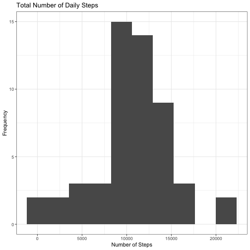
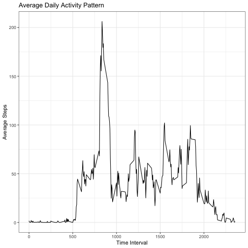
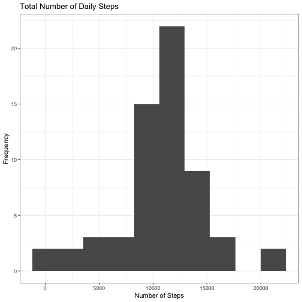
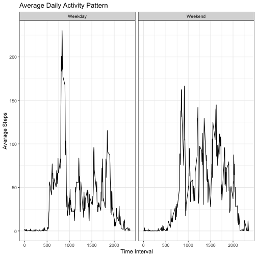

# Reproducible Research Programming Assignment 1
## Jace Jones-Tabah

This assignment makes use of data from a personal activity monitoring device. This device collects data at 5 minute intervals through out the day. The data consists of two months of data from an anonymous individual collected during the months of October and November, 2012 and include the number of steps taken in 5 minute intervals each day.

The data for this assignment can be downloaded from the course web site

The variables included in this dataset are:

steps: Number of steps taking in a 5-minute interval
date: The date on which the measurement was taken in YYYY-MM-DD format
interval: Identifier for the 5-minute interval in which measurement was taken


## Loading and Preprocessing Data
#### Load data (read.csv)

```r
setwd("/Users/jacejones-tabah/Desktop/R_Practice/Course 5 Reproducible Research/Assignment1/RepData_PeerAssessment1")
Data <- read.csv("activity.csv")
```
#### Load Libraries

```r
library(tidyverse)
```

#### Examine data and convert date strings to date format


```r
str(Data)
```

```
## 'data.frame':	17568 obs. of  3 variables:
##  $ steps   : int  NA NA NA NA NA NA NA NA NA NA ...
##  $ date    : Factor w/ 61 levels "2012-10-01","2012-10-02",..: 1 1 1 1 1 1 1 1 1 1 ...
##  $ interval: int  0 5 10 15 20 25 30 35 40 45 ...
```

```r
Data$date <- as.Date(Data$date)
```

# What is mean total number of steps taken per day?
##### Ignoring missing values
#### Calculate total steps per day and display the data in a histogram 


```r
Data_day <- Data %>% group_by(date)%>%
        summarise(Day_sum = sum(steps))
              

ggplot(data=Data_day, aes(Day_sum))+
        geom_histogram(bins = 10)+
        theme_bw()+
        labs(y= "Frequency", x = "Number of Steps", title = "Total Number of Daily Steps")
```

```
## Warning: Removed 8 rows containing non-finite values (stat_bin).
```



#### What are the mean and median number of steps per day

```r
Data_Summary <- Data_day %>%
        summarise(Mean_steps = mean(Day_sum, na.rm=TRUE),
                  Median_steps = median(Day_sum, na.rm=TRUE))

print(Data_Summary)
```

```
## # A tibble: 1 x 2
##   Mean_steps Median_steps
##        <dbl>        <int>
## 1     10766.        10765
```
The mean number of steps taken per day is 10766.
The median number of steps taken per day is 10765.

# What is the average daily activity pattern?
#### Plot the average number of steps in each 5-minute time interval throughout the day


```r
Data_interval <- Data %>%
        group_by(interval)%>%
        summarise(Interval_mean = mean(steps, na.rm=TRUE))

ggplot(data=Data_interval, aes(x=interval, y=Interval_mean))+
        geom_line()+
        theme_bw()+
        labs(y = "Average Steps", x = "Time Interval", title="Average Daily Activity Pattern")
```



#### Which 5-minute interval, on average across all the days in the dataset, contains the maximum number of steps?


```r
Max_Interval <- Data_interval[which.max(Data_interval$Interval_mean),]
```
Interval 835 has the most average steps witha  mean of 206.1698 steps

# Imputing Missing Values

#### Calculate the total number of missing values (intervals for which there is no step count)

```r
Missing <- sum(is.na(Data$steps))
```
There are 2304 missing values

#### Inpute interval means to substitute missing values

```r
Data_imputed <- merge(Data, Data_interval, by="interval")
Data_imputed <- Data_imputed %>% arrange(date, interval) %>%
        mutate(steps_imputed = ifelse(is.na(steps), Interval_mean, steps))%>%
        select(interval, date, steps_imputed)
```

#### Calculate total steps per day and display the data in a histogram 


```r
Data_day <- Data_imputed %>% group_by(date)%>%
        summarise(Day_sum = sum(steps_imputed))
              

ggplot(data=Data_day, aes(Day_sum))+
        geom_histogram(bins = 10)+
        theme_bw()+
        labs(y= "Frequency", x = "Number of Steps", title = "Total Number of Daily Steps")
```



#### What are the mean and median number of steps per day

```r
Data_Summary <- Data_day %>%
        summarise(Mean_steps = mean(Day_sum),
                  Median_steps = median(Day_sum))

print(Data_Summary)
```

```
## # A tibble: 1 x 2
##   Mean_steps Median_steps
##        <dbl>        <dbl>
## 1     10766.       10766.
```
After substituting interval means for missing values, the mean number of steps taken per day is 10766 and the median number of steps taken per day is also 10766.

# Are there differences in activity patterns between weekdays and weekends?

#### Create factor variable identifying weekdays and weekends

```r
Data_Week <- Data_imputed %>%
        mutate(Day = as.factor(weekdays(Data_imputed$date)))%>%
        mutate(Type = ifelse(Day %in% c("Saturday", "Sunday"), "Weekend", "Weekday"))
```

### Group data by weekday versus weekend and plot mean step counts

```r
Data_Type <- Data_Week %>% 
        group_by(Type, interval) %>%
        summarise(step_mean = mean(steps_imputed))

ggplot(data=Data_Type, aes(x=interval, y=step_mean))+
        geom_line()+
        facet_grid(.~Type)+
        theme_bw()+
        labs(y = "Average Steps", x = "Time Interval", title="Average Daily Activity Pattern")
```



